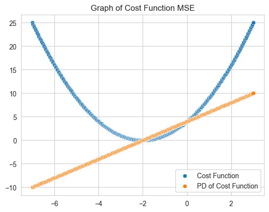

# Linear Regression & Batch Gradient Descent 

## Introduction

In this repo, we provide a quick but comprehensive overview of linear regression and batch gradient descent.

## Dataset

In the notebook, we use sklearn's boston housing dataset, specifically

* MedInc: median income in block group
* AveRooms: average number of rooms per household of block group
* target: ln(median house value) of block group

## Linear Regression

In this case, we assume that MedInc and AveRooms have a linear relationship with the target. If such is the case, we can write out the linear regression model as the following

$$\hat{y} = m_1 x_1 + m_2 x_2 + b$$

* $\hat{y}$ is the predicted target variable
* $m_1$ is the parameter coeffecient for $x_1$
* $x_1$ is the value for MedInc
* $m_2$ is the parameter coeffecient for $x_2$
* $x_2$ is the value for MedInc
* $b$ is the intercept parameter

## Linear Regression example

Say for example the linear regression model takes the following form, parameters $m1, m2$, and $b$ have been randomly chosen for illustration purposes. 

$$y = 0.64 x_1 + 0.3 x_2 + 2$$

We want to predict the median house value of a block group that has MedInc: $8.4$, and AveRooms: $1.2$

Using the model, we can plug those values to compute a target value

$y = 0.64 (8.4) + 0.3 (1.2) + 2$
$y = 7.736$

Thus, the median house value of a block group with MedInc: $8.4$ and AveRooms $1.2$ according to our model would be $7.736$

If our model is a good representation of our dataset, we can see how linear regression may by useful. Rather than pulling a guess out of thin air for the median house value of a block group, we can make a estimated guess given our linear regression model.

Now you may ask, how may we compute these parameters, $m_1$, $m_2$, and $b$ for our model? This leads us to our next topic of discussion, batch gradient descent

## Batch Gradient Descent

In this section, we will dive into batch gradient descent. Batch Gradient descent is a learning algorithm that enables us to find the optimal parameters in our model such that it minimizes the error of the model.

As a quick snippet, Batch Gradient Descent first intializes parameters randomly, and then uses the gradient to change the parameter to a value which will result in a lower error. 

Don't worry if you didn't understand, the following subsections shall clarify and explain Batch Gradient Descent in much greater detail.

### Cost Function

The Ideal Linear Regression model would predict values that are not far away from the real values. Thus, the best model is the model that predicts values that are the closest to the real values.

We can define the error of prediction as $$y_i - \hat{y_i}$$

* $i$ is the row instance/occurance
* $y$ is the actual value for the ith row
* $\hat{y}$ is the predicted value for the ith row

For example, take the following dataset.

| Real Values | Predicted |
|-------------|-----------|
| 2           | 1         |
| 5           | 3         |

For i = 1 (row 1), the error is 2 - 1 = 1
For i = 2 (row 2), the error is 5 - 3 = 2

In the end, we want to find a model that has the smallest error. Thus, to evaluate a model, we can sum all the errors across all rows of our dataset to find the total error produced by the model. 

However, using $y_i - \hat{y_i}$ as our error metric raises some issues. As a result, we make some small alternations to our error metric.

1) To negate the effect of direction, we square all the computed errors per row. 
2) After taking the sum, we then divide by $n$ number of rows to find the *average* squared error.

In short,

$$MSE = 1/n \sum_{i = 1}^{n}(y_i - \hat{y_i}) ^ 2$$

*MSE*, also known as *Mean Squared Error* is just a fancy word to describe what was said above in words. To take the *mean* of the *squared errors*.

In code, we would structure MSE by
1) Finding the error for every row $i$
2) Summing them up the squares of the errors to negate the effect of direction
3) divide by $n$ to find the average MSE, where $n$ is the number of rows

Now that we have a cost function, we can now focus on minimizing our cost function.

## Cost Minimization

To recap, the best performing model is the model with the lowest error (MSE in this case). Cost minimization focuses on changing our model's **parameters** such that we can achieve the lowest error possible.

#### Example of Cost Minimization

We will illustrate cost minimization first with a simple example. We still use the same dataset (Boston) and the same linear regression model $y = m_1 x_1 + m_2 x_2 + b$

From the model, we know $m_1$, $m_2$, and b are parameters that we can *change*. 

Let's take a look at one parameter for now. Say for example we are using a simplified dataset of the one above involving only one row.

*Simplified Dataset*

| MedInc | AveRooms | Target |
|--------|----------|--------|
| 2      | 1        | 1      |

Let's randomly initialize our parameters. Say our random initialization sets the following values for our parameters

* $m_1$ = 1
* $m_2$ = 1
* $b$ = 1

Our model then looks like this
$y = 1 (x_1) + 1 (x_2) + 1$

We can then plug in the values of MedInc and AveRooms from our dataset into our model. Our model yields the following result
$y = 1 (2) + 1 (1) + 1$
$y = 4$

And thus, the following error
$y_i - \hat{y_i}$ = 1 - 4
$y_i - \hat{y_i}$ = - 3

$MSE Error = 9$

Let's try to change our parameter $b$ to improve our model. We could change $b$ to - 2. Thus, our model would take the following form.
$y = 1 (x_1) + 1 (x_2) - 2$

And would yield the following result
$y = 1 (2) + 1 (1) - 2$
$y = 1$

And as a result, our error would be
$y_i - \hat{y_i}$ = 1 - 1
$y_i - \hat{y_i}$ = 0

$MSE Error = 0$

As you can see, the error has decreased from 2 to 0! Therefore, by definition, our second model with $b = - 2$ is a better model, as the error is lower in the second model as opposed to first model.

This example beautifully simplifies cost minimization by changing one parameter. However, our linear regression is composed of multiple parameters, and our dataset is composed of many rows. 

In a more complicated case with many data points (rows) and many parameters (for example $m_1$, $m_2$, $b$) the goal is to optimize all parameters such that the sum of the errors of all data points are minimized. Rather than optimization/minimization through trial and error, we can use gradient descent.

#### Graphical Representation of Cost Minimization

Before diving into gradient descent, we first look at a graphical representation of cost minimization, which will help us understand how gradient descent works.

Let's focus on optimizing one parameter first so that cost can be minimized. Thus, let us set $m_1$ and $m_2$ to an abritrary number, say 1.

Our model then takes the following form

$\hat{y} = 1 (x_1) + 1 (x_2) + b$

The question now is, how do we set b optimially that minimizes cost?

Let us look at the cost equation again, but this time replacing $\hat{y_i}$ with our model equation (*Underlined*).

$$MSE = 1/n \sum_{i = 1}^{n}(y_i - \hat{y_i}) ^ 2$$
$$MSE = 1/n \sum_{i = 1}^{n}(y_i - \underline{(x_1 + x_2 + b)}) ^ 2$$

If our dataset is composed of one row only ($n=1$), the cost equation is simplified to the following

$$MSE = 1/1 \sum_{i = 1}^{1}(y_i - \underline{(m_1x_1 + m_2x_2 + b)}) ^ 2$$
$$MSE = (y_i - \underline{(m_1x_1 + m_2x_2 + b)}) ^ 2$$

How can we minimize b so that cost is simplified? We know by calculus that we can take the partial derivative of a the cost function ($MSE$) with respect to $b$, and set the equation to 0, to find the *minimum* of the function.

The partial derivative of $MSE$ with respect to $b$ is:

$$\frac{\partial MSE}{\partial B} = -2(y_i - \underline{(m_1x_1 + m_2x_2 + b)})) $$

We can plot this partial derivative (denote as PD in orange) on a graph. Let us set arbitrary values to $x_1, x_2$ for graphing purposes, and use the simplified dataset such that $y_i$ = 1, $x_1 = 2$, $x_2 = 1$, and both parameters of $m$ = 1.

$MSE = (1 - \underline{(2 + 1 + b)}) ^ 2$

$\frac{\partial MSE}{\partial B} = -2(1 - \underline{(2 + 1 +  b)})) $

---

---

As we can see, the minimum of the cost function ($b = -2$) can be found using the partial derivative. We can set the partial derivative equal to 0, and solve for b! 

This is the same answer we found through our trial and error example.

However, in complicated examples, finding the partial derivative of functions aren't very easy. As a result, we can opt for batch gradient descent, a learning algorithm that helps us solve for the optimal parameters. 

## Batch Gradient Descent

Batch Gradient Descent is a learning algorithm which can help us solve for the optimal parameters of our model.

To explain batch gradient descent, we will first explain the formula, and jump straight into an example.

In batch gradient descent, update all the parameters by the following update rule

$$m_j := m_j - \alpha \frac{\partial Cost}{\partial m_j}$$

Therefore in our case, we would use the following batch gradient descent formulas to optimize our parameters

$m_1 := m_1 - \alpha \frac{\partial Cost}{\partial m_1}$
$m_2 := m_2 - \alpha \frac{\partial Cost}{\partial m_2}$
$m_b := b - \alpha \frac{\partial Cost}{\partial b}$

In words, 

* you first set all parameters to arbitrary numbers, 
* update the parameter by using difference between the current value, and a product involving a learning rate, and the partial derivative of cost with respect to the parameter you are updating.

While there are many great online resources explaining batch gradient descent, I like to explain batch gradient descent with the following illustration.

We know that a parameter yields the lowest cost when the partial derivivative of that parameter, when respect to cost is 0. Thus, if parameter value yields a partial derivative result that is near 0, then m1 is near it's optimal value which minimizes cost. 

The update rule for the parameter thus wouldn't have a big effect, and as a result the parameter wouldn't really change. 

However if the partial derivative yields a large result greater than 0, then the update rule for the parameter would yield a big change.

You may have questions as regards to what $\alpha$ is, our why exactly we subtract the current parameter by the product of $\alpha$ and it's gradient (the partial derivative of Cost with respect the parameter). Here are two great resources which you can refer to.
1. [towards data science post by Mayank Mishra on why to subtract the gradient](https://towardsdatascience.com/wondering-why-do-you-subtract-gradient-in-a-gradient-descent-algorithm-9b5aabdf8150#:~:text=While%20in%20gradient%20descent%20algorithm,in%20the%20gradient%20descent%20algorithm.)
2. [towards data science post by Hafidz Zulkifli on learning rate and how different learning rates influence learning](https://towardsdatascience.com/understanding-learning-rates-and-how-it-improves-performance-in-deep-learning-d0d4059c1c10)

#### Batch Gradient Descent Example

Refer to the code notebook under train. You can see when we generate params, how the line starts to better fit the data over time. You can also see how loss begins to decrease heavily over the iterations of gradient descent, and converges.

In summary, 

Gradient Descent helps us adjust the parameters such that the update results in a smaller error. Over many iterations, the hope is that gradient descent updates our parameters over and over such that the error approchas a minimum.

## Conclusion

Hopefully this reading has been informative and illustrates the concept of linear regression and batch gradient descent. 

